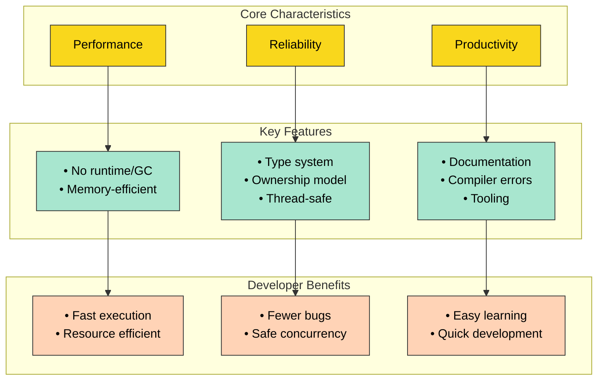

Question: What is Rust?

Rust is a modern programming language designed to empower everyone to build reliable and efficient software 0:0. Created to address long-standing challenges in software development, Rust combines high performance with strong safety guarantees while maintaining practical usability.

###  Key Characteristics

1. **Performance and Efficiency**  - Runs without runtime overhead or garbage collector
  - Provides performance comparable to C++
  - Efficient memory usage
  - Seamlessly integrates with other languages 0:1

2. **Reliability Features**  - Rich type system for compile-time safety checks
  - Unique ownership model ensuring memory safety
  - Built-in thread safety guarantees
  - Eliminates common bugs at compile time rather than runtime 0:2

3. **Developer Experience**  - Comprehensive documentation
  - User-friendly compiler with helpful error messages
  - Modern tooling ecosystem
  - Integrated package manager and build tools 0:3

###  Real-World Applications

1. **Command Line Tools**  - Quick development of CLI applications
  - Easy distribution and maintenance
  - Robust ecosystem support 0:5

2. **WebAssembly**  - Seamless integration with JavaScript
  - Compatible with npm and webpack
  - Performance optimization capabilities 0:6

3. **Network Services**  - Consistent performance
  - Minimal resource footprint
  - Rock-solid reliability 0:7

4. **Embedded Systems**  - Support for resource-constrained devices
  - Low-level control with high-level abstractions
  - Ideal for hardware programming 0:8

###  Industry Adoption

Major companies actively use Rust in production environments, including:

- Firefox
- Dropbox
- Cloudflare 0:9

> "My biggest compliment to Rust is that it's boring, and this is an amazing compliment." - Chris Dickinson, Engineer at npm, Inc 0:9

The diagram above illustrates how Rust's core characteristics flow into concrete features and ultimately deliver practical benefits to developers. The yellow boxes show Rust's fundamental pillars, which enable the green feature boxes containing specific technical implementations. These features ultimately lead to the orange benefit boxes, representing the practical advantages developers experience when using Rust.

###  Why Choose Rust?

Rust stands out in today's programming landscape by providing a unique combination of safety guarantees without sacrificing performance. Its focus on preventing common programming errors while maintaining efficiency makes it particularly attractive for systems programming and high-performance applications. With its growing ecosystem and strong community support, Rust continues to gain popularity among both startups and large corporations looking to build reliable, fast, and maintainable software solutions.